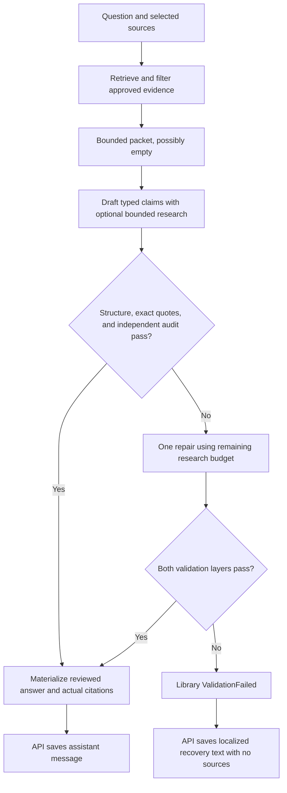

# Conversational answer reliability

AskRabbi separates source-backed teaching, ordinary background, and honest uncertainty inside one reviewed answer pipeline. A basic question such as “Who was Rabbi Akiva?” can receive an independently reviewed introductory biography without a Torah citation. An empty search result does not by itself prevent a conversational answer. Religious rulings, attributed teachings, exact quotations, and calculated dates still require verified evidence.

This policy applies to conversational answers. The [weekly Dvar Torah publisher](../Backend/AskARabbi.DvarTorahJob/README.md) has its own draft schema, grounding ratios, review, and publication gate; it does not publish conversational recovery replies.

## Responsibilities

| Component | Responsibility |
| --- | --- |
| `GroundedAnswerService` in `AskARabbiLIB` | Retrieve and bound evidence, draft, validate structure and exact quotations, request an independent audit, and allow one repair. Return the answer or a typed failure with diagnostics. |
| `AIGroundedClaimEvidenceValidator` | Audit the complete draft for responsiveness and each statement for relevance, accuracy, scope, and support appropriate to its kind. |
| [Shared prompt catalog](../Prototype/Prompts/README.md) | Keep writer, repair, audit, and strict schemas aligned. The API copies these files into its published output; the prototype loads the same catalog. |
| `GroundedConversationTurnService` in the API | Enforce account usage, supply saved context, persist reviewed answers or application-written recovery replies, and retain the original library outcome in diagnostics. |
| `ConversationRecoveryText` in the API | Supply fixed, honest recovery wording in the selected response language without another model call. |
| Frontend | Display the saved assistant message and its actual sources. An empty `sources` array is valid; it does not imply a broken response. |
| Prototype | Render reviewed answers, including uncited background. Report unrecovered library failures; one-shot `ask` returns a nonzero exit code. It does not implement the API's saved recovery reply. |

## Internal claim contract

The writer's strict JSON schema requires `kind` on every claim:

| Kind | Allowed content | Evidence contract | Independent review |
| --- | --- | --- | --- |
| `Source` | Religious rulings, attributed teachings, textual interpretations, exact quotations, and deterministic calendar results. | Real evidence IDs, with exact quotations covering every cited ID; attribution must be supported. | The supplied evidence must support the complete statement and any claimed interpretive relationship. |
| `Background` | Well-established basic biography, history, introductory definitions, and clearly identified fictional premises. | Empty `evidenceIds` and `quotations`; null attribution. | Check accuracy, relevance, and restricted scope using general knowledge. This is not corpus verification. |
| `Uncertainty` | An honest limit, a relevant clarification, or a statement that the available material cannot establish the requested conclusion. | Empty `evidenceIds` and `quotations`; null attribution. | Check that it helps answer the question and does not conceal an unsupported substantive conclusion. |

An answer may mix these kinds. Disagreements remain source-backed and have no separate kind selector. A missing kind in an older/custom internal draft defaults to `Source`; unknown values are rejected. Production structured output requires the field, so omission is not a way to obtain uncited content.

A fictional vampire's “alive,” “dead,” or “undead” status can be explained as depending on the story's rules. That does not establish a real Jewish-law ruling about death or Jewish status. Claims such as “Jewish law has no category for vampires” still need source support. Unrelated animal-bite or divorce passages cannot establish a supernatural legal conclusion. Relabeling an unsupported ruling as `Background` must fail review.

## Processing and recovery

1. Initial retrieval still respects the conversation's enabled sources and trusted provenance. The adequacy gate removes irrelevant evidence; empty or inadequate ordinary retrieval can continue with an empty packet. This is not an offline or provider-outage bypass.
2. The writer can use registered source, dictionary, and relevant calendar capabilities within the existing shared four-execution budget. An empty packet no longer forces an initial `search_source_passages` call. The request reports `sourceResearchAvailable`; it does not require research for a basic biography or honest limitation.
3. Deterministic validation checks the kind-specific shape and exact quotation substrings. User-visible claims, titles, attributions, quotation roles, and follow-ups cannot expose internal generation mechanisms. Valid-sized hidden limitation notes that mention those mechanisms are discarded before materialization, so unused diagnostic wording cannot suppress an otherwise valid answer.
4. The independent auditor receives the bounded evidence packet and all statements. For `Source`, it can reconcile citations against any supplied passage, then the application revalidates the exact quotations. It cannot invent evidence or attach citations to `Background` or `Uncertainty`.
5. One repair may rewrite or remove unsupported statements and use remaining bounded research. All repaired content passes the same checks again. Exhausted or failed review remains a library failure.
6. Explicit compound parashah requests retain their preflight: the calendar must resolve the reading and the selected Torah sources must provide representative story coverage. Missing coverage can still return `InsufficientEvidence` before drafting.

### Web API outcomes

Both conversation creation and append-message endpoints use the same policy:

| Library or transport outcome | Web behavior |
| --- | --- |
| Reviewed answer, with or without citations | Persist the rendered answer and actual source snapshots; return `status: "answered"`. |
| `ValidationFailed` or `InsufficientEvidence` | Persist fixed localized recovery text with `sources: []`; return `status: "answered"` with no error message. Preserve the original failure and trace internally. |
| AI provider unavailable or authentication failure | Keep the existing `ai_unavailable` or `ai_authentication_failed` outcome; do not save a recovery reply for that outage. |
| Retrieval unavailable, including rejected corpus metadata | Keep `retrieval_unavailable`; do not bypass the failed dependency with an uncited model answer. |
| Cancellation, admission/accounting failure, or exhausted quota | Keep the existing cancellation and [usage](TOKEN_USAGE.md) behavior; no recovery success masks these conditions. |

The English recovery text is:

> I'm not confident enough to give a reliable answer to that yet. I'd rather be clear about that than guess. Which part would you like to focus on, or is there a particular passage you have in mind?

Equivalent fixed replies cover English, French, German, Hebrew, Italian, Persian, Polish, Russian, Spanish, and Yiddish. Unsupported or absent language values use English. The response-language preference chooses the reply, independently of the source-quotation language.

The reply uses the same deterministic assistant-message ID derived from the user-message ID as a reviewed answer. Once saved, retries return the existing reply without repeating model work. Reloading the conversation retains it. A recovery reply does not apply a title from the rejected draft. It can appear in later untrusted conversation context, but is never evidence.

## Contracts, storage, and accounting

- `kind` belongs to the internal writer/auditor contracts. Public `GroundedAnswer`, HTTP message bodies, compact/full turn responses, and MongoDB message shapes are unchanged. Custom prompt catalogs should adopt the updated kind contract; existing clients need no migration.
- Source-free reviewed answers and fixed replies use normal assistant content with an empty sources list. Do not infer a validation failure from the absence of citations or synthesize source cards.
- Rejected drafts and their citations are not saved as assistant messages. Reviewed answers and fixed recovery replies use the same account ownership and deletion rules as other history; see [chat storage](CHAT_PRIVACY.md).
- All provider-reported chat tokens still count, including retrieval, audits, repairs, and rejected or incomplete responses. A fixed recovery reply adds no model request and does not refund prior work. Background questions still use normal admission, retrieval, drafting, and auditing.
- Completion logs distinguish the original library status, validation result, repair flag, and whether a reply was persisted. HTTP `answered` alone does not establish that a generated draft passed review.
- No new production package, database migration, configuration key, or separate answer endpoint is required.

## Verification and rollout

Deploy the library and shared prompt catalog together through the normal API image build. Keep the managed corpus and local canonical-source assets intact; permitting background does not remove retrieval configuration.

Regression coverage belongs in the library's grounding tests and the API's conversation tests. Verify these cases when changing the contract:

- Basic biography succeeds with no relevant textual evidence and remains independently audited.
- Fictional identity/life-status questions stay within the fictional premise; actual religious conclusions retain source requirements.
- Misclassified religious claims, invented evidence IDs, altered quotations, and citations on uncited kinds are rejected.
- Hidden limitation metadata does not suppress a valid answer; visible internal mechanics still fail validation.
- An unrepaired validation failure or insufficient-evidence result saves one localized, citation-free API reply, survives reload, and is idempotent on retry.
- Provider, retrieval, cancellation, and quota failures keep their distinct outcomes.
- The weekly publisher still enforces its separate grounding and publication rules.

The September 17, 2026 implementation was checked with 1,495 library tests, 315 API tests, 39 weekly-job tests, and a prototype build. Live prototype probes for Rabbi Akiva and the two vampire questions passed independent review. These checks do not establish that a particular deployed API revision has passed an authenticated smoke test.
