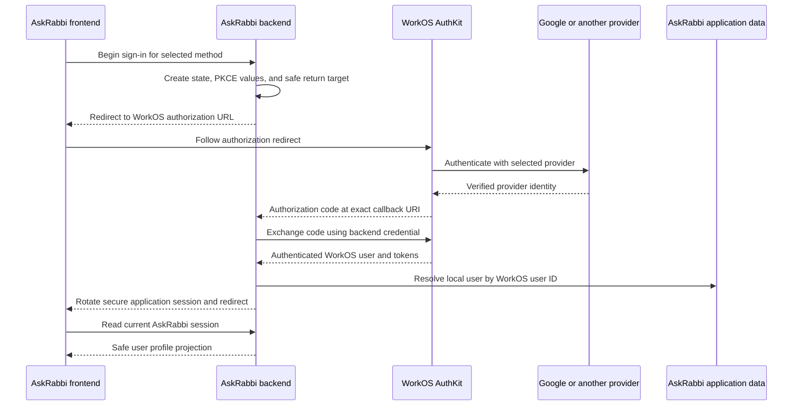

# Production authentication plan

## Decision

AskRabbi will use WorkOS AuthKit as its authentication and user-management infrastructure. WorkOS is not a user-facing sign-in method. Users will choose a recognizable method such as Google, Apple, Microsoft, or email, and WorkOS will broker that flow behind the AskRabbi backend.

The current frontend remains a local demo. Its `AuthClient` contract names user-facing methods and deliberately contains no WorkOS-specific method. The production implementation will call the AskRabbi API; the browser will never receive the WorkOS API key.

This plan was checked against the WorkOS documentation on August 24, 2026:

- [AuthKit overview](https://workos.com/docs/authkit/overview)
- [Social Login](https://workos.com/docs/authkit/social-login)
- [Modeling an AuthKit application](https://workos.com/docs/authkit/modeling-your-app)
- [Users and Organizations](https://workos.com/docs/authkit/users-organizations)
- [Authorization URL API](https://workos.com/docs/reference/authkit/authentication/get-authorization-url)
- [Official WorkOS .NET SDK](https://github.com/workos/workos-dotnet)

## User-facing methods

The recommended rollout is intentionally smaller than the complete WorkOS integration catalog:

| Method | Launch position | Reason |
| --- | --- | --- |
| Google | Primary social option | Broad consumer adoption and the method explicitly requested for AskRabbi. |
| Email Magic Auth | Primary fallback | A one-time email code avoids storing an AskRabbi password and supports users without a selected social provider. |
| Apple | Planned secondary option | Useful for privacy-conscious and Apple-device users. |
| Microsoft | Planned secondary option | Useful for users whose main identity is a Microsoft personal, school, or work account. |
| Enterprise SSO | Later, organization-driven | WorkOS supports it, but AskRabbi does not yet have an organization or institutional product requirement. |

WorkOS currently documents built-in social or OAuth integrations including Google, Microsoft, GitHub, Apple, GitLab, LinkedIn, Slack, ADP, Bitbucket, Intuit, Rippling, Xero, and others. AskRabbi should not expose every technically supported provider. GitHub, LinkedIn, Slack, and other business-oriented options can be enabled later only when user demand justifies the extra login choices.

Facebook is not currently listed in the WorkOS Social Login documentation or the authorization provider values. It is therefore not part of the AskRabbi plan. Reconsider it only if WorkOS adds documented first-class support and AskRabbi users demonstrate a need for it.

Email/password is supported by AuthKit, but Magic Auth is the preferred email method for the first release. WorkOS has deprecated Magic Links in favor of a one-time six-digit Magic Auth code.

## Production flow

The backend will use the official `WorkOS.net` SDK if its AuthKit surface satisfies the implementation requirements at that milestone. Otherwise, a narrow typed HTTP adapter will call the documented WorkOS API. No WorkOS package is added until the backend project exists and the exact SDK version has been reviewed and pinned.

## Planned API boundary

| Endpoint | Responsibility |
| --- | --- |
| `GET /auth/providers` | Return only the methods enabled for the current environment so the frontend never hard-codes backend availability. |
| `GET /auth/login/{provider}` | Validate the provider and return target, establish state and PKCE, then redirect to WorkOS. |
| `GET /auth/signup` | Start the AuthKit sign-up flow. |
| `GET /auth/callback` | Validate state, exchange the authorization code, resolve the local user, and create the AskRabbi session. |
| `GET /auth/session` | Return the authenticated user's safe frontend projection or an unauthenticated result. |
| `POST /auth/logout` | Revoke or invalidate the server session, clear the cookie, and complete WorkOS logout when required. |
| `POST /auth/magic/start` | Start an email Magic Auth challenge if AskRabbi keeps its custom email UI. |
| `POST /auth/magic/verify` | Verify the one-time code and establish the same application session used by social login. |

The provider route will use an allow-listed enum rather than accepting an arbitrary provider string. The initial allow-list is `google`, with `apple` and `microsoft` added only after their WorkOS dashboard configurations are complete.

## Identity and data ownership

WorkOS owns authentication methods, provider identities, email verification state, MFA, and normalized identity profiles. AskRabbi owns religious personalization, source preferences, saved conversations, usage state, and product authorization.

The application database will store its own immutable user ID and a unique WorkOS user ID. Email is mutable profile data and must not be AskRabbi's database identity or authorization key. WorkOS can automatically link enabled authentication methods that resolve to the same verified email, but AskRabbi will continue to authorize application records by its immutable local user ID.

Only the minimum display projection should reach the frontend:

- AskRabbi user ID
- Display name
- Email address and verification state when the UI needs them
- Profile-image URL when enabled
- Product roles or permissions

Provider access tokens and refresh tokens will not be returned to the frontend or stored unless a future feature has a specific, reviewed need for provider API access.

## Session and security requirements

- Keep the WorkOS API key and provider client secrets in backend secret storage only.
- Use exact allow-listed HTTPS redirect URIs outside local development.
- Require OAuth `state` and PKCE, reject replay, and expire incomplete flows quickly.
- Use an opaque application session ID in a `Secure`, `HttpOnly`, `SameSite=Lax`, `Path=/` cookie. Prefer the `__Host-` cookie prefix in production.
- Rotate the application session after login, privilege changes, and sensitive account operations.
- Store WorkOS refresh material only in encrypted server-side session storage if it is required.
- Request only identity scopes needed for login; do not request Google Calendar, mail, contacts, or other provider data.
- Protect state-changing API calls from CSRF and keep CORS limited to the deployed AskRabbi origin.
- Validate WorkOS webhook signatures before applying user changes or deletion events.
- Do not log authorization codes, cookies, access tokens, refresh tokens, secrets, or complete authentication payloads.
- Rate-limit login starts and Magic Auth verification attempts without revealing whether an account exists.

## Frontend migration

The current `demoAuthClient` remains process-memory-only. The production adapter will replace it with an API-backed client that starts backend redirects and reads `/auth/session`. Components will continue to request `google`, `apple`, or `microsoft`; they will not import WorkOS SDK types or know WorkOS provider identifiers such as `GoogleOAuth`.

When backend integration begins:

1. Fetch enabled methods from `/auth/providers`.
2. Render only those methods in the existing AskRabbi visual system.
3. Replace demo sign-in and sign-up results with full-page redirects to the backend routes.
4. Hydrate the authenticated user from `/auth/session` on startup.
5. Make logout await the backend response before clearing client user state.
6. Add callback, expired-session, cancelled-login, account-linking, provider-failure, and rate-limit states.

The frontend must never claim a session exists merely because a provider redirect returned. The backend session endpoint is the authority.

## Acceptance criteria for the integration milestone

- Google login creates or resolves exactly one AskRabbi user and establishes a secure application session.
- Repeated Google or email login for the same linked WorkOS identity resolves the same local user.
- Disabled providers cannot be selected by editing a URL.
- Callback state, PKCE, replay, unsafe return URLs, expired codes, and provider cancellation fail safely.
- Logout invalidates the server session and clears the browser cookie.
- No WorkOS or social-provider secret appears in frontend assets, browser storage, logs, or API responses.
- Authentication tests use a fake WorkOS boundary; live WorkOS calls remain a separate manual smoke test.
- Facebook is absent unless WorkOS later documents first-class support and the product decision is revisited.
