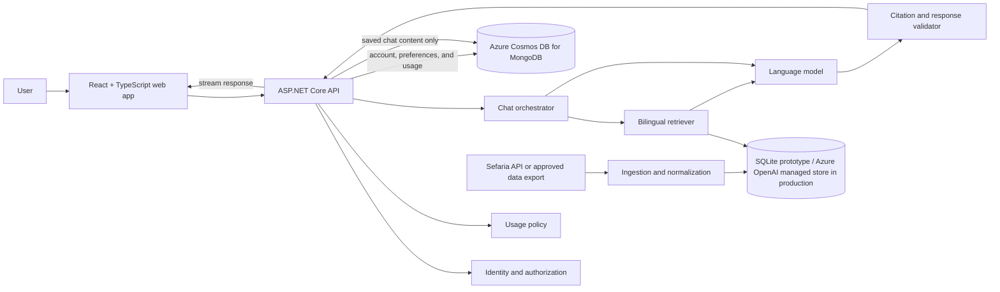

# AskRabbi technical design

[](#status-and-scope)
[](https://vite.dev/)
[](https://react.dev/)
[](https://www.typescriptlang.org/)
[](https://dotnet.microsoft.com/apps/aspnet)
[](https://developers.sefaria.org/)

This document describes the implemented local grounding prototype and the production frontend/API path for an account-based, source-grounded AI chat application. WorkOS identity, Azure Cosmos DB for MongoDB persistence, Azure OpenAI generation, managed Responses file-search retrieval, validated assistant persistence, and monthly usage enforcement are wired in code. Full corpus publication, live integration validation, and public-launch hardening remain.

For the product mission, intended experience, and guiding principles, read the [project README](../README.md). For the step-by-step implemented question, retrieval, grounding, validation, and follow-up path, read the [chat workflow](CHAT_WORKFLOW.md).

## Contents

- [Status and scope](#status-and-scope)
- [Implemented local prototype](#implemented-local-prototype)
- [Design goals](#design-goals)
- [Proposed system architecture](#proposed-system-architecture)
- [Component responsibilities](#component-responsibilities)
- [Citation contract](#citation-contract)
- [Answer behavior contract](#answer-behavior-contract)
- [Conversation privacy modes](#conversation-privacy-modes)
- [API surface](#api-surface)
- [Proposed domain model](#proposed-domain-model)
- [Usage limits](#usage-limits)
- [Security and correctness baseline](#security-and-correctness-baseline)
- [Observability](#observability)
- [Testing and evaluation strategy](#testing-and-evaluation-strategy)
- [Suggested repository layout](#suggested-repository-layout)
- [Delivery plan](#delivery-plan)
- [Open decisions](#open-decisions)
- [Non-goals for the first release](#non-goals-for-the-first-release)
- [Local development](#local-development)

## Status and scope

The repository now contains a reusable .NET library, a thin console application, the production frontend shell, and a tested .NET 10 API foundation. The decisions below are divided into two groups:

- **Implemented foundation:** Vite, React, TypeScript, and Tailwind CSS; a responsive login/dashboard shell; a replaceable frontend authentication boundary; a .NET 10 ASP.NET Core API; WorkOS AuthKit code exchange and password recovery behind a narrow adapter; encrypted application cookies; owner-scoped MongoDB stores; Azure OpenAI Responses; forced managed file-search retrieval; fail-closed answer persistence and usage enforcement; and deterministic frontend, library, and API tests.
- **Committed direction:** User-facing Google and other reviewed WorkOS methods; Azure Cosmos DB for MongoDB application persistence; saved and private conversations; configurable usage limits; bilingual Jewish texts; source selection; and verifiable citations.
- **Open implementation choices:** long-term retrieval migration criteria, background-job system, server-side session persistence, and conversation retention. The first production retriever is an Azure OpenAI managed vector store, the model deployment is `askarabbi-gpt-5-mini`, and the public topology is fixed at `https://askarabbi.ai` plus `https://api.askarabbi.ai`.

Dependencies and infrastructure should be selected only when an implementation milestone needs them. This keeps the first version small and prevents an early prototype from silently becoming the permanent privacy or security architecture.

## Implemented local prototype

`AskARabbiLIB` and `AskARabbiPrototype` implement the textual-grounding proof of concept without production persistence or search infrastructure:

- Manifest schema 1.3 assigns each retained Sefaria artifact a stable checksum-derived `documentId` and validated typed license terms.
- `SourceIndexBuilder` verifies normalized Markdown checksums, parses canonical `##` references, validates segment counts/ranges, and atomically builds an untracked SQLite FTS5 index.
- The v3 index stores exact segments on disk with schema metadata and a corpus-and-license fingerprint. The document manifest remains in memory; segment text does not. A corpus change makes an older local index fail verification until it is deliberately rebuilt.
- `SqliteSourceRetriever` supports exact-reference lookup, tiered BM25 keyword retrieval, normalized Hebrew/Unicode search, provenance filters, neighboring context, and bounded results. A deterministic query planner prioritizes reviewed concepts and keeps every fallback attached to a recognized topic anchor, such as `Shabbat`, while retaining full, paired, and broad tiers for questions without a reviewed anchor.
- `GroundedAnswerService` retrieves at most 50 candidates, rejects empty or tangential evidence before generation, and builds a default evidence packet of at most 24 segments and 48,000 text characters. It favors source diversity, can pair Hebrew and translation versions by canonical reference, and includes a six-segment context radius while capping one document at nine included segments.
- `UserProfile` and `UserProfileJsonSerializer` provide strict, reusable profile validation, deterministic age calculation, normalized JSON, and rejection of unknown fields. Interactive chat requires a selected or custom profile; one-shot `ask` accepts an optional profile file name from `Prototype/Profiles`.
- `AzureOpenAIEngine` supports both `ApiKeyCredential` and Entra `TokenCredential`, explicitly supplies the configured deployment on every Responses API call, sets `store=false`, requests strict JSON Schema output, propagates cancellation, and returns typed failures plus response/token/latency diagnostics. The local console reads `AI:APIKey` from .NET User Secrets or an environment variable and chooses the API-key path; the reusable library retains its Entra-capable constructor for future hosting.
- Every model-facing instruction, the strict response schemas, and the application-controlled interpretive notice live in `Prototype/Prompts`. The host loads and validates them into `GroundedPromptSet` only when AI Chat or `ask` is used, so Source Search remains independent of prompt and Azure configuration. The behavior contract uses conversational BLUF and targets two or three connected claims and 180–325 words of explanatory prose for ordinary questions.
- Optional `AzureKeyVaultSecretStore` is lazy, cancellation-aware, and caches requested values for 15 minutes. The prototype does not use it to load the Azure OpenAI API key.
- Retrieved material is delimited as untrusted data. Every substantive claim and disagreement must quote every evidence ID it cites, every quotation must exactly match its source segment, and a claimed later-to-earlier reasoning chain requires exact passages for both links. A second structured model request independently checks each statement's relevance and support from its cited passages. One same-evidence repair is allowed after either validation layer before the answer fails visibly.
- Profile fields are separately labeled as untrusted personalization context. Exact dates of birth stay local; only calculated age is sent to the model. Profile fields never enter lexical retrieval, never count as source evidence, and may not be used to stereotype or assume observance.
- The Spectre.Console host starts with AI Chat as the first option and exposes Source Search separately. All approved logical sources begin enabled; `/sources` displays the on/off inventory with edition, passage, and language counts and changes the source set used by each subsequent retrieval. Before chat it requires a saved local JSON profile or process-memory custom context. Questions and follow-ups use a spaced `You` / `AskARabbi AI` transcript with a bold direct answer and natural follow-on paragraphs. Compact citation numbers remain beside their claims; exact quotations already written in a paragraph are highlighted yellow in place and are not repeated, while supporting quotations absent from the prose retain one yellow quotation with a cyan source line. Full retrieved context remains available through `/evidence` instead of being dumped into every answer. It omits a redundant closing bibliography because validated sources already appear inline. The editable application-controlled interpretive notice ends every validated answer in italic grey. Clearing or leaving AI Chat removes conversation turns, answers, evidence references, and traces from process memory; the only prototype persistence is a user-explicit local profile JSON that never contains chat content.
- Prototype composition is split by responsibility: `ConsoleApplication` owns only process-level orchestration; `ApplicationStateLoader` loads the manifest and local configuration; `AIChatConsole` owns the in-memory conversation; `SourceSearchConsole` owns source inspection; `SegmentIndexConsole` owns local index lifecycle; `OneShotCommandExecutor` owns automation commands; and `ConsolePresentation` owns Spectre rendering. Safety-critical behavior remains in `AskARabbiLIB` and is covered by the library test solution.

The implementation adapts the useful interface/configuration, prompt-building, retry, diagnostic, credential-specific client, Key Vault, and invariant BSON temporal-serialization ideas from ClearVowAI. AskRabbi supplies its own focused MongoDB stores because the audited ClearVowAI services contained serializers and BSON use but no reusable owner-scoped Mongo repository. It deliberately excludes Foundry Agents and model-controlled hosted file-search orchestration, reflection-discovered tools, web search, image handling, SQL/Redis services, cryptographic key rotation, Newtonsoft.Json, NJsonSchema, Tiktoken, and unrelated setup helpers. The managed-vector adapter forces a single-purpose Responses file-search call and retains application control behind `ISourceRetriever`; it is not an Agent engine.

## Design goals

1. **Ground every substantive claim.** The model should answer from a bounded evidence packet built from approved source collections.
2. **Make citations inspectable.** A citation must resolve to the passage and edition that actually supports the nearby claim.
3. **Preserve textual context.** Original language, translation, genre, author or tradition, time period, and canonical reference must remain distinguishable.
4. **Represent disagreement.** Retrieval and generation must not collapse minority, majority, historical, and contemporary views into one anonymous position.
5. **Avoid prescriptive judgment.** The application explains sources and reasoning; it does not issue personalized *psak* or evaluate a user's Jewish identity or observance.
6. **Make privacy modes real.** “Private” must change storage, logging, analytics, and debugging behavior—not merely hide a chat from the sidebar.
7. **Fail visibly.** When evidence is missing, conflicting, or weak, the response should narrow its claim, ask for context, or decline to answer.
8. **Keep providers replaceable.** Application contracts should prevent identity, storage, retrieval, or model vendors from leaking throughout the codebase.

## Proposed system architecture



The answer model is intentionally downstream of retrieval and a deterministic evidence-adequacy gate. It receives a limited, structured source packet and instructions about what it may claim. Exact citation validation and an independent claim-support audit occur after generation and before the response is treated as complete.

## Component responsibilities

### Web application

The Vite, React, and TypeScript frontend is expected to provide:

- Registration, sign-in, sign-out, and account management.
- A streaming chat interface with clear saved/private mode selection.
- A source panel that pairs each citation with the relevant passage.
- Hebrew and translation display, including right-to-left layout.
- Source-collection and response preferences.
- Saved conversation management.
- Usage and limit visibility.
- Accessible keyboard, screen-reader, responsive, and reduced-motion behavior.

The frontend must treat all authorization and quota data as display information. The API remains responsible for enforcing access and limits.

The current shell implements compact responsive Personalization and Settings screens. Personalization captures full name; birth date and time; one reviewed U.S. IANA time zone; independent conversation and source-quotation languages; religious movement or practice; Jewish heritage or community; and optional context limited to 2,000 characters. Supported languages are English by default plus French, German, Hebrew, Italian, Persian, Polish, Russian, Spanish, and Yiddish. The backend validates and persists that profile. Settings loads the authenticated account email, exact monthly usage window, and conversation defaults from the API, and it sends password-reset requests to the backend. Only a versioned session-storage integer for non-sensitive welcome copy remains session-local.

Each frontend conversation owns an enabled-source-key set that matches `DocumentSourceCatalog`: `collection:Torah`, `collection:Tanakh`, `collection:Mishnah`, `collection:Talmud`, `work:rif`, `work:mishneh_torah`, `work:shulchan_arukh_with_rema`, `work:zohar`, `work:zohar_chadash`, and `work:mesillat_yesharim`. New drafts enable the four core collections—Torah, Tanakh, Mishnah, and Talmud—but remain browser-only until the first message is submitted; supplemental works are explicit opt-ins. The create request persists metadata and that first message together, preventing abandoned drafts from becoming empty sidebar records. The first validated structured response may return a concise conversation title; the backend applies it only when no earlier assistant response exists, while explicit user renames remain authoritative afterward. Non-empty source selections are validated and persisted by the API; clearing every source disables submission instead of allowing an ungrounded fallback. The exact selection is stored with the canonical conversation context. Conversation and quotation languages are presentation preferences, not source evidence. Retrieval searches all available approved editions within the selected sources so a preference such as Persian or Russian cannot erase the evidence corpus; exact quotations must still be copied from an available edition and may not be machine-invented as source text.

The browser does not calculate a Hebrew birthday. Because the Hebrew date changes at sunset, a time zone alone cannot establish precise local sunset. The future API should request birthplace when the birth time is near sunset, use historical offset data and a reviewed sunset/calendar implementation, preserve the user-entered civil details, return the calculated Hebrew date and assumptions, and allow correction. Personalization remains untrusted user context: it may guide wording and relevant source distinctions, but it cannot count as evidence or justify assumptions about observance or identity.

### ASP.NET Core API

The implemented backend is a .NET 10 controller API. `GET /health` reports process health; dependency-specific readiness checks are still pending. `UserController` owns allow-listed WorkOS AuthKit login hints, constant-time state validation, S256 PKCE, code exchange, rotating session refresh, local-account resolution, safe session projection, password recovery, and logout. `ConversationsController` owns saved conversation creation, navigation summaries, owner-authorized context loading, grounded message turns, title/source updates, and deletion. `GroundedConversationTurnService` checks usage, obtains personalization, reconstructs limited recent validated history, calls the provider-neutral grounding service, persists only validated assistant text under a deterministic ID, and records successful usage. `ConversationSettingsController` owns personalization, account-backed conversation defaults, and exact UTC calendar-month usage reporting.

The browser receives an encrypted `HttpOnly` application cookie and never receives the WorkOS API key or access token. Its rotating WorkOS refresh token is contained only inside the ASP.NET Core protected ticket and is unavailable to JavaScript; the API renews it near provider-token expiration and rejects provider-revoked sessions. The ticket lasts at most eight sliding hours. A reviewed shared server-side session/revocation store and shared data-protection key ring remain required before horizontally scaled public deployment. WorkOS and MongoDB may be omitted for process-only health checks, and their endpoints normally fail explicitly with `503`. A separate `local-demo` launch profile is accepted only in the `Development` environment and supplies process-memory substitutes for an end-to-end local walkthrough; production cannot enable it. Credentialed CORS permits only exact configured origins, with the Vite origin defaulted solely in Development.

Azure Cosmos DB for MongoDB is accessed behind `IUserAccountStore`, `IConversationStore`, `IConversationSettingsStore`, and `IUsageStore`. Conversation metadata and messages occupy separate collections so sidebar reads avoid message bodies and appends do not rewrite an ever-growing document. Personalization and conversation preferences share an owner-keyed settings document but use independent field updates. Store filters always include the local user ID for user-owned resources, and required uniqueness/navigation indexes are initialized at configured startup.

The API is expected to own:

- Authentication integration and resource authorization.
- User profile and preference operations.
- Saved conversation lifecycle.
- Private conversation request handling.
- Server-side usage accounting and limit enforcement.
- Retrieval, model, and citation-validation orchestration.
- Streaming responses and cancellation.
- Redaction-aware telemetry and audit events.

Controllers should remain thin. Business rules belong in application services, and provider-specific code should sit behind narrow interfaces.

The implemented controller boundary is:

| Controller | Responsibility |
| --- | --- |
| `UserController` | WorkOS-hosted login, callback, session, password recovery, and logout |
| `ConversationsController` | Saved conversation lifecycle, source settings, message ingestion, and canonical context |
| `ConversationSettingsController` | Current personalization and exact monthly usage window |

The message endpoint returns a stable status plus canonical conversation context by default. `compact=true` returns navigation metadata plus only the current user/assistant messages; the production frontend uses that additive contract and merges the delta into context it already holds. This keeps response size bounded as a conversation grows while preserving compatibility for existing clients. Sequential retries with the same client message ID reuse the deterministic assistant ID and do not call the model again. Validated assistant messages persist bounded structured source snapshots containing exact quotations, presented context, canonical passage links, edition attribution, language, license, and excerpt state. A persistent reservation/finalization record is still required to prevent duplicate provider work and usage increments from truly simultaneous retries across multiple replicas. Streaming and private mode remain product work.

### Chat orchestration

The orchestrator should coordinate a request without containing vendor-specific HTTP or database logic. A request moves through:

1. Authentication, authorization, and usage-policy checks.
2. Input validation and privacy-mode resolution.
3. Question analysis and optional clarification.
4. Retrieval from only the user's enabled source collections.
5. Deterministic evidence-adequacy validation and construction of a bounded packet.
6. Model generation using the product's nonjudgmental behavior contract.
7. Deterministic quotation/citation validation and an independent claim-support audit.
8. Materializing trusted source metadata and returning the response.
9. Durable storage of validated prose and its bounded source snapshots only when the request uses saved mode.
10. Usage accounting without retaining private message content.

Cancellation must propagate from the browser through retrieval and model requests so abandoned generations do not continue consuming capacity.

### Source ingestion and retrieval

The source pipeline uses the reviewed Sefaria export and version metadata to produce a checksum-verified, permissively licensed normalized corpus. The same manifest drives both the local SQLite index and an immutable production managed-vector publication.

Every ingested segment should preserve at least:

| Field | Purpose |
| --- | --- |
| Canonical reference | Stable, human-readable citation such as `Shabbat 18a` or `Genesis 2:2` |
| Work and category | Distinguishes Tanakh, Talmud, Midrash, responsa, commentary, and other genres |
| Source language | Preserves Hebrew, Aramaic, or another original language |
| Version language | Identifies the language of this edition or translation |
| Version title | Prevents unattributed mixing of translations |
| Text | The exact segment used for retrieval and quotation |
| License and attribution | Determines whether and how the version may be used |
| Source URL | Lets the user inspect the passage in its library context |
| Relationship metadata | Connects commentaries, parallels, and related texts |
| Content checksum | Supports change detection and reproducible evaluations |
| Retrieved or published timestamp | Supports refresh and provenance audits |

Sefaria's [Texts v3 endpoint](https://developers.sefaria.org/reference/get-v3-texts) exposes source and translation versions plus version metadata. The [reference system](https://developers.sefaria.org/docs/text-references) provides a basis for canonical citations.

No ingestion job should assume that all publicly viewable text has the same reuse rights. License rules should be enforced per edition, and removal or correction must be able to invalidate indexed segments.

#### Retrieval strategy

The local proof of concept implements:

- Lexical retrieval for exact terms, names, and canonical references.
- Normalized Hebrew/Unicode matching while retaining exact display text.
- Metadata filtering by collection, language, category, and user settings.
- Canonical-reference pairing of Hebrew and available translations.
- Limited adjacent-segment context.
- Diversity-aware ranking so one repeated source does not crowd out meaningful disagreement.

The first production adapter is `AzureOpenAIVectorStoreRetriever`. `AzureOpenAIVectorStoreCorpusPublisher` creates deterministic uploads capped at 60,000 UTF-8 bytes and marks each compact source record with stable segment/document IDs, canonical reference, context token, exact text, and explicit excerpt bounds. The checked 1,441-document corpus becomes 8,332 provider files. The publisher supplies sixteen provenance attributes, but the current Responses results omit them; the API therefore bundles the validated manifest, resolves each stable document prefix locally, and treats any returned attributes only as consistency checks. Before accepting a search result, the retriever verifies store schema/fingerprint/logical-document/provider-file counts and revalidates every complete record, permissive license, requested source/category/language filter, stable ID, and bound locally.

Azure OpenAI performs managed keyword/semantic search through a forced Responses `file_search` call, but it does not own final answer generation or citation metadata. Retrieval-model prose is discarded; only scored file-search results proceed through local provenance/filter checks and then the same evidence builder and validation layers as SQLite. This means a production answer has a small retrieval-model call followed by the separate grounded-answer call. Azure AI Search remains a future migration option if evaluation shows a need for stronger hybrid ranking, custom analyzers, relationship expansion, or predictable provisioned throughput. See [MANAGED_VECTOR_STORE.md](MANAGED_VECTOR_STORE.md) for publication, IAM, cost, and rollback operations.

#### Bilingual handling

Original text and translations should be stored as separate, explicitly related versions. The system should:

- Retain Hebrew diacritics while also generating a normalized search form.
- Preserve right-to-left text and punctuation for display.
- Align versions through canonical segment references rather than inferred paragraph order.
- Identify the translation whenever it quotes translated wording.
- Search in the language of the question and expand into relevant source-language terminology.
- Never silently generate its own “translation” and present it as an existing published version.

## Citation contract

A citation is more than a reference-looking string. Each generated citation should carry structured evidence:

```text
SourceCitation
  Reference
  WorkTitle
  Category
  VersionTitle
  Language
  QuotedText
  AttributionUrl
  License
  LicenseCategory
  RequiresAttribution
  RequiresShareAlike
  SupportedClaimIds
```

The production conversation contract maps validated citations into additive `sources` arrays on assistant messages. Each entry contains the exact matched quotation list, the evidence text presented to the model, a canonical Sefaria passage URL derived from the trusted reference, and a separate edition-attribution URL. Legacy message records without this field remain valid and return an empty list. Clicking an inline citation opens the matching array entry in a responsive reader: an independently scrollable right rail at the `xl` breakpoint and a modal bottom sheet on smaller screens. Both surfaces provide previous/next navigation and keep surrounding context collapsed unless the saved account preference explicitly opens it.

Before a completed answer is shown, validation should confirm that:

- The canonical reference exists in the approved corpus.
- The quotation matches the identified version.
- The citation is attached to the claim it supports.
- The source packet contains enough context to avoid a misleading excerpt.
- Descriptions of consensus or disagreement are supported by more than one isolated passage when appropriate.
- The answer does not cite retrieved text that says something materially different.

If validation fails, the system should regenerate from the same bounded evidence, remove the unsupported claim, or tell the user that it could not verify the answer. It should never repair a citation by inventing a more plausible reference.

## Answer behavior contract

System behavior and automated evaluations should enforce the following rules:

- Explain relevant sources, categories, reasoning, and historical development.
- Label the community, authority, or interpretive framework associated with a view.
- Separate direct textual statements from later inference and modern application.
- Avoid declaring what the user personally must believe or do.
- Do not shame, moralize about, or rank a user's Jewish identity or observance.
- State uncertainty and the boundaries of the enabled corpus.
- Ask a concise clarifying question when context materially affects the discussion.
- Suggest consulting a qualified human when the user requests personalized religious direction or the stakes are high.
- Never imply that a citation makes the generated answer infallible.

The interface should describe the product as an educational tool, not a rabbi or a source of formal religious rulings.

## Conversation privacy modes

Saved and private conversations should be separate server-side policies represented by an explicit enum or value object, not a client-only flag.

| Behavior | Saved chat | Private chat |
| --- | --- | --- |
| Prompt and response in application database | Stored | Not stored |
| Appears in chat history | Yes | No |
| Can be resumed later | Yes | No |
| Source packet retained with conversation | Stored as required for reproducibility | Not stored |
| Content in application logs | Prohibited by default | Prohibited |
| Non-content usage counters | Stored | Stored |
| Transient in-memory processing | Required | Required |

Private-mode requirements:

- Message text, generated text, and retrieved source packets must not be written to the application database, logs, traces, analytics, dead-letter queues, or error reports.
- The system may retain non-content facts such as account ID, request ID, timestamp, latency, status, token counts, and quota units when needed for security and operation.
- Model and infrastructure providers must be configured and contractually evaluated for retention and training behavior.
- The UI and privacy notice must disclose unavoidable transient processing and any verified provider retention window.
- A failed private request must not fall back to a durable queue or saved conversation.
- Support tooling must not expose private content because that content should not exist in the persistence layer.

Until those properties are tested in the deployed environment, the product should not advertise private mode as “zero retention” or “never leaves your device.”

## API surface

The implemented foundation exposes:

| Method and route | Purpose |
| --- | --- |
| `GET /health` | Return process health without requiring configured external services |
| `GET /api/user/login` | Start WorkOS AuthKit with state, S256 PKCE, and optional validated email/provider/sign-up hints |
| `GET /api/user/callback` | Exchange the code and establish the local application session |
| `GET /api/user/session` | Return the current safe account projection |
| `POST /api/user/forgot-password` | Request password recovery without account enumeration |
| `POST /api/user/reset-password` | Confirm a reset and clear the current application cookie |
| `POST /api/user/logout` | Clear the cookie and return the provider logout destination |
| `GET /api/conversations` | List recent owned conversation summaries |
| `POST /api/conversations` | Persist the first user message, run its grounded response, and return the new conversation with its one-time AI-generated title when successful |
| `GET /api/conversations/{conversationId}` | Return one owner-authorized conversation and its messages with trusted assistant-source snapshots |
| `POST /api/conversations/{conversationId}/messages` | Idempotently store a user turn, run fail-closed retrieval/generation/validation, persist only a validated answer and trusted sources, and return canonical context plus a typed outcome |
| `PUT /api/conversations/{conversationId}/title` | Rename an owned conversation |
| `PUT /api/conversations/{conversationId}/sources` | Replace approved source selectors |
| `DELETE /api/conversations/{conversationId}` | Delete an owned conversation and its messages |
| `GET /api/conversation-settings/usage` | Return exact current UTC billing-period dates and usage |
| `GET /api/conversation-settings/personalization` | Return configured or unconfigured personalization |
| `PUT /api/conversation-settings/personalization` | Validate and replace personalization |
| `GET /api/conversation-settings/preferences` | Return account-backed conversation defaults |
| `PUT /api/conversation-settings/preferences` | Replace account-backed conversation defaults |

All identifiers must be authorization-checked against the authenticated account. A valid identifier is not proof of access.

Request boundaries should validate message length, allowed modes, enabled collections, language settings, and cancellation. Expected failures such as quota exhaustion should return stable domain error codes rather than provider exception text.

## Proposed domain model

The persistence model should remain small for the first release:

| Model | Responsibility |
| --- | --- |
| `User` | Application account identity and status |
| `UserPreferences` | Enabled collections, languages, and display or answer preferences |
| `Conversation` | Saved chat ownership, title, and timestamps |
| `Message` | Saved user or assistant content and ordering |
| `Citation` | Structured source evidence attached to a saved assistant message |
| `MonthlyUsage` | Current atomic answer count and exact UTC calendar-month boundary; reservation/finalization is still planned |
| `TextSegment` | Indexed source passage and provenance metadata |
| `TextRelationship` | Links between passages, commentary, parallels, and topics |

Private chats should use request-scoped models that are never accepted by persistence repositories.

## Usage limits

Limits should be configurable policy, not scattered numeric checks. The API should:

- Reserve capacity before starting an expensive model call.
- Finalize actual usage idempotently when the request completes.
- Release or reconcile reservations after cancellation and failure.
- Return the remaining allowance and reset boundary in a stable response model.
- Enforce limits server-side and safely handle concurrent requests.
- Keep plan or pricing concepts outside the chat domain until the product needs them.

Usage records should avoid message content. They need operational quantities, not the substance of a user's religious question.

## Security and correctness baseline

Before public access, the implementation should include:

- A maintained identity solution rather than custom password cryptography.
- Authorization checks on every user-owned resource.
- Secure, `HttpOnly`, appropriately scoped cookies or an equally reviewed token design.
- CSRF protection when browser credentials are sent automatically.
- Restrictive CORS, security headers, request-size limits, and rate limiting.
- Secret storage outside source control and structured configuration validation at startup.
- Encryption in transit and encryption at rest for persisted user content.
- Account deletion and conversation deletion with documented retention behavior.
- Prompt-injection defenses that treat retrieved text as data, never as executable instructions.
- Output encoding and sanitization for source text or model-produced markup.
- Dependency, container, and secret scanning in continuous integration.

Provider error payloads and stack traces must not be returned to clients. Expected validation, authorization, quota, retrieval, and provider failures should map to intentional application errors.

## Observability

Useful telemetry does not require collecting conversations. Recommended signals include:

- Request count, latency, status, cancellation, and streaming duration.
- Retrieval latency, candidate count, source categories, and empty-result rate.
- Model latency, token counts, finish reason, and provider error category.
- Citation-validation pass rate and regeneration count.
- Usage reservation and reconciliation failures.
- Ingestion freshness, changed segments, failed licenses, and index version.

Content capture should be disabled by default. Any future opt-in quality-reporting flow must be explicit, narrow, revocable, and separate from private mode.

## Testing and evaluation strategy

### Backend tests

Use MSTest for .NET tests, with deterministic fakes or strict mocks around identity, time, persistence, retrieval, and model providers. Tests should cover:

- Authorization and cross-account access attempts.
- Saved/private persistence behavior, including failure paths.
- Usage reservations, concurrency, cancellation, and idempotency.
- Input validation and precise application errors.
- Citation-validation acceptance and rejection.
- Provider timeouts and partial streaming failures.
- Deletion and retention rules.

Integration tests use in-memory identity and persistence substitutes plus injected fixed time, never production services, user-profile key stores, live credentials, or live user data. The current backend suite exercises authentication state/PKCE, cookie establishment/removal, non-enumerating recovery, authorization, saved-conversation workflows, idempotent message ingestion, personalization validation, and exact usage periods. The library suite separately enforces at least 80% branch coverage in CI.

### Frontend tests

The current Vitest and Testing Library suite covers invalid login input, injected login/logout behavior, rotating welcome copy, conversation creation, rename and confirmed deletion, core-source defaults and source persistence, message storage, clickable citation navigation, exact quotation/context display, pending-answer animation, profile validation, U.S. time-zone selection, API-reported usage, password-reset disclosure, settings preferences, and save toasts. Adapter tests verify credentialed requests, structured API failures, authorization-state mapping, idempotency IDs, and offset-free birth-time serialization. Later milestones should add coverage for:

- Mode selection and unmistakable privacy language.
- Streaming, cancellation, retry, and error states.
- Full right-to-left source-language display.
- Right-to-left layout and keyboard navigation.
- Account isolation in cached client state.
- Usage-limit messaging without exposing provider details.

### Retrieval and answer evaluations

Traditional unit tests are necessary but insufficient for a grounded AI product. A versioned evaluation set should contain representative questions, expected relevant references, known disagreements, and adversarial cases.

Key measures should include:

- Retrieval recall for expert-selected sources.
- Citation precision and exact quotation match.
- Claim-level faithfulness to the evidence packet.
- Correct identification of disagreement and source hierarchy.
- Abstention when the enabled corpus lacks support.
- Robustness to prompt injection inside user input and retrieved content.
- Nonjudgmental language without erasing substantive differences.
- Equivalent source quality across supported query languages.

The release gate should include review by people with appropriate Jewish textual expertise. Automated scoring alone cannot establish interpretive quality.

## Suggested repository layout

The repository now has explicit production frontend and backend boundaries alongside the two independent proof-of-concept solutions:

```text
Library/
├── AskARabbiLIB.slnx
├── AskARabbiLIB/
└── AskARabbiLIB.Tests/
Prototype/
├── AskARabbiPrototype.slnx
└── AskARabbiPrototype/
```

`AskARabbiLIB.slnx` owns manifest search, segment indexing/retrieval, AI/secret adapters, grounding/validation, session models, and all MSTest coverage. `AskARabbiPrototype.slnx` contains only the Spectre.Console host and references the library project; it has no test project and owns no reusable algorithms or corpus models.

```text
AskARabbi/
├── Frontend/                     # Implemented Vite, React, TypeScript, and Tailwind shell
├── Backend/                      # .NET 10 ASP.NET Core host and integration tests
├── Library/                      # Reusable corpus, retrieval, AI, and grounding code
├── Prototype/                    # Local Spectre.Console search and AI host
├── Tools/                        # Reproducible managed-corpus publisher and verifier
├── Data/                         # Raw and normalized licensed corpus metadata
├── docs/
│   └── TECHNICAL.md
└── README.md
```

The number of .NET projects should be revisited during scaffolding. If the first implementation does not benefit from four assemblies, fewer projects with clear internal boundaries are preferable.

## Delivery plan

### Phase 0: decisions and guardrails

- Record the behavior contract and non-goals.
- Evaluate text licenses and required attribution.
- Configure WorkOS environments and the selected Azure Cosmos DB for MongoDB account; select retrieval, model, and hosting providers.
- Define the private-chat threat model and retention contract.
- Assemble the first expert-reviewed evaluation set.

### Phase 1: application foundation

- Connect the implemented Vite/React frontend to the ASP.NET Core API contract.
- Complete server-side WorkOS session revocation, shared data-protection keys, rate limiting, CORS/CSRF, and account lifecycle handling.
- Add dependency readiness checks and deployed-environment smoke tests.
- Establish content-free observability.

### Phase 2: textual grounding proof of concept

- Ingest a deliberately small, licensed bilingual corpus from Sefaria.
- Evaluate canonical-reference links and structured source presentation against the production corpus.
- Compare SQLite and managed retrieval against the evaluation set.
- Generate bounded answers and validate citations.

### Phase 3: conversation product

- Add saved chats and deletion.
- Add private chats and verify non-persistence through automated tests.
- Add streaming, cancellation, source settings, and usage controls.
- Add Hebrew, translation, and right-to-left presentation.

### Phase 4: trust and release readiness

- Expand the licensed corpus and re-run evaluations.
- Conduct scholarly, accessibility, privacy, and security reviews.
- Red-team hallucination, prompt injection, judgmental language, and cross-user access.
- Publish accurate terms, privacy disclosures, source attribution, and limitations.
- Deploy the initial release to [askarabbi.ai](https://askarabbi.ai).

## Open decisions

The following choices should be made through small proof-of-concept measurements and documented before production:

- Server-session persistence, revocation, and retention strategy for the WorkOS-backed login flow.
- Azure Cosmos DB for MongoDB provisioning mode, partition/shard-key policy, backup, retention, and data migration strategy.
- Criteria and timing for migrating from the managed vector store to a dedicated hybrid search service.
- Sefaria live API, periodic export, or hybrid ingestion.
- Model/provider regional processing, retention, and training terms after Azure's initial production deployment.
- Streaming protocol and retry semantics.
- Hosting region and data residency.
- Exact source-selection model exposed to users.
- Conversation retention duration and account-deletion window.
- Scholarly review process and governance for disputed answers.
- Licensing and permission process for non-Sefaria Q&A material.

## Non-goals for the first release

- Replacing a rabbi, teacher, community, or formal halakhic process.
- Claiming comprehensive coverage of every Jewish text or tradition.
- Training a foundation model from scratch.
- Ingesting publicly visible material without verified reuse rights.
- Building social feeds, public debates, or user-published answers.
- Hiding uncertainty to make answers sound more authoritative.

## Local development

The production frontend shell expects the API at `http://localhost:5090` by default. Run the API's explicit Development-only local profile when WorkOS and MongoDB credentials are unavailable:

```powershell
dotnet run --project Backend/AskARabbi.Api --launch-profile local-demo

cd Frontend
pnpm install
pnpm dev
pnpm verify
```

Node.js 22.12 or newer and pnpm 11 are required. In `local-demo`, the browser still calls the real HTTP controllers and uses the real application cookie, but the API process owns an in-memory identity and datastore; restarting the API clears that data. Grounded chat uses the same production service only when all `AI:*` values are configured. With all of them omitted, liveness and the account/conversation walkthrough remain available while chat returns `ai_unavailable` without a provider call. See `Frontend/README.md` for the client boundary.

The production API foundation runs on .NET 10. `GET /health` works without external configuration; authenticated persistence endpoints require WorkOS and MongoDB, and grounded chat requires the complete AI/vector-store settings documented in `Backend/README.md`. All backend JSON configuration is secret-free. Local credentials live in .NET User Secrets; deployed credentials come from the hosting platform's secret configuration:

```powershell
dotnet restore Backend/AskARabbiBackend.slnx
dotnet build Backend/AskARabbiBackend.slnx -c Release --no-restore
dotnet test Backend/AskARabbiBackend.slnx -c Release --no-build --no-restore
dotnet run --project Backend/AskARabbi.Api --launch-profile http
```

Both development launch profiles listen on `http://localhost:5090`. The normal `http` profile uses configured WorkOS and MongoDB services and fails their endpoints closed when configuration is absent; `local-demo` is the credential-free walkthrough. See `Backend/README.md` for the exact response and smoke-test command.

Source Search and index management need no Azure configuration. Prototype AI Chat additionally requires an Azure OpenAI resource endpoint, a deployed model name, and the matching resource API key in .NET User Secrets or an environment variable:

```powershell
dotnet build Library/AskARabbiLIB.slnx -c Release
dotnet test Library/AskARabbiLIB.slnx -c Release --no-build
dotnet build Prototype/AskARabbiPrototype.slnx -c Release
dotnet run --project Prototype/AskARabbiPrototype -- index build
dotnet run --project Prototype/AskARabbiPrototype -- index verify --format json
dotnet run --project Prototype/AskARabbiPrototype -- search "Shabbat" --collection Talmud
$env:AI__ProjectEndpoint = "https://your-resource.openai.azure.com"
$env:AI__ModelName = "your-deployment"
dotnet user-secrets --project Prototype/AskARabbiPrototype set "AI:APIKey" "your-resource-api-key"
dotnet run --project Prototype/AskARabbiPrototype -- ask "What do the retrieved sources say about this question?"
dotnet run --project Prototype/AskARabbiPrototype --
```

The prototype does not initialize Key Vault; the empty example section only documents that decision while the reusable library retains an optional lazy secret-store adapter for future hosts. The root `appsettings.json` contains only non-sensitive configuration, remains ignored, and is not copied into build or publish output. User Secrets are stored outside the repository. Questions, answers, prompts, and evidence are not logged or persisted by this prototype. See `Library/README.md` for reusable APIs and tests and `Prototype/README.md` for complete commands.
