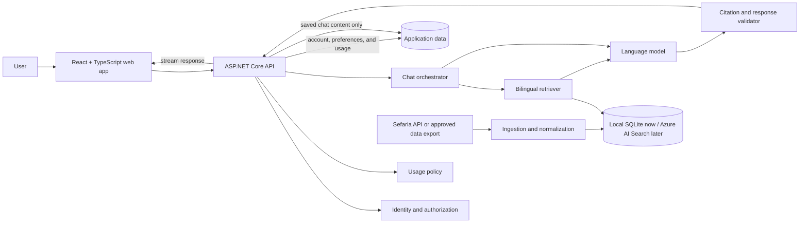

# AskRabbi technical design

[](#status-and-scope)
[](https://vite.dev/)
[](https://react.dev/)
[](https://www.typescriptlang.org/)
[](https://dotnet.microsoft.com/apps/aspnet)
[](https://developers.sefaria.org/)

This document describes the implemented local grounding prototype, the initial production frontend shell, and the proposed production direction for an account-based, source-grounded AI chat application. The web shell is real code; connected accounts, the API, durable chats, and production infrastructure remain design targets.

For the product mission, intended experience, and guiding principles, read the [project README](../README.md). For the step-by-step implemented question, retrieval, grounding, validation, and follow-up path, read the [chat workflow](CHAT_WORKFLOW.md).

## Contents

- [Status and scope](#status-and-scope)
- [Implemented local prototype](#implemented-local-prototype)
- [Design goals](#design-goals)
- [Proposed system architecture](#proposed-system-architecture)
- [Component responsibilities](#component-responsibilities)
- [Citation contract](#citation-contract)
- [Answer behavior contract](#answer-behavior-contract)
- [Conversation privacy modes](#conversation-privacy-modes)
- [Proposed API surface](#proposed-api-surface)
- [Proposed domain model](#proposed-domain-model)
- [Usage limits](#usage-limits)
- [Security and correctness baseline](#security-and-correctness-baseline)
- [Observability](#observability)
- [Testing and evaluation strategy](#testing-and-evaluation-strategy)
- [Suggested repository layout](#suggested-repository-layout)
- [Delivery plan](#delivery-plan)
- [Open decisions](#open-decisions)
- [Non-goals for the first release](#non-goals-for-the-first-release)
- [Local development](#local-development)

## Status and scope

The repository now contains a reusable .NET library, a thin console application, and the first production frontend shell. The production API is reserved but has not been scaffolded. The decisions below are divided into two groups:

- **Implemented foundation:** Vite, React, TypeScript, and Tailwind CSS; a responsive login/dashboard shell; a replaceable authentication-client boundary; process-memory demo conversations and personalization; and frontend lint, component-test, and build verification.
- **Committed direction:** An ASP.NET Core API with backend-owned WorkOS AuthKit integration; user-facing Google, email Magic Auth, Apple, and Microsoft methods; user accounts; saved and private conversations; configurable usage limits; bilingual Jewish texts; source selection; and verifiable citations.
- **Open implementation choices:** database, vector or hybrid search technology, model provider, hosting platform, background-job system, and deployment topology.

Dependencies and infrastructure should be selected only when an implementation milestone needs them. This keeps the first version small and prevents an early prototype from silently becoming the permanent privacy or security architecture.

## Implemented local prototype

`AskARabbiLIB` and `AskARabbiPrototype` implement the textual-grounding proof of concept without production persistence or search infrastructure:

- Manifest schema 1.3 assigns each retained Sefaria artifact a stable checksum-derived `documentId` and validated typed license terms.
- `SourceIndexBuilder` verifies normalized Markdown checksums, parses canonical `##` references, validates segment counts/ranges, and atomically builds an untracked SQLite FTS5 index.
- The v3 index stores exact segments on disk with schema metadata and a corpus-and-license fingerprint. The document manifest remains in memory; segment text does not. A corpus change makes an older local index fail verification until it is deliberately rebuilt.
- `SqliteSourceRetriever` supports exact-reference lookup, tiered BM25 keyword retrieval, normalized Hebrew/Unicode search, provenance filters, neighboring context, and bounded results. A deterministic query planner prioritizes reviewed concepts and keeps every fallback attached to a recognized topic anchor, such as `Shabbat`, while retaining full, paired, and broad tiers for questions without a reviewed anchor.
- `GroundedAnswerService` retrieves at most 50 candidates, rejects empty or tangential evidence before generation, and builds a default evidence packet of at most 24 segments and 48,000 text characters. It favors source diversity, can pair Hebrew and translation versions by canonical reference, and includes a six-segment context radius while capping one document at nine included segments.
- `UserProfile` and `UserProfileJsonSerializer` provide strict, reusable profile validation, deterministic age calculation, normalized JSON, and rejection of unknown fields. Interactive chat requires a selected or custom profile; one-shot `ask` accepts an optional profile file name from `Prototype/Profiles`.
- `AzureOpenAIEngine` supports both `ApiKeyCredential` and Entra `TokenCredential`, explicitly supplies the configured deployment on every Responses API call, sets `store=false`, requests strict JSON Schema output, propagates cancellation, and returns typed failures plus response/token/latency diagnostics. The local console reads `AI:APIKey` from ignored configuration and chooses the API-key path; the reusable library retains its Entra-capable constructor for future hosting.
- Every model-facing instruction, the strict response schemas, and the application-controlled interpretive notice live in `Prototype/Prompts`. The host loads and validates them into `GroundedPromptSet` only when AI Chat or `ask` is used, so Source Search remains independent of prompt and Azure configuration. The behavior contract uses conversational BLUF and targets two or three connected claims and 180–325 words of explanatory prose for ordinary questions.
- Optional `AzureKeyVaultSecretStore` is lazy, cancellation-aware, and caches requested values for 15 minutes. The prototype does not use it to load the Azure OpenAI API key.
- Retrieved material is delimited as untrusted data. Every substantive claim and disagreement must quote every evidence ID it cites, every quotation must exactly match its source segment, and a claimed later-to-earlier reasoning chain requires exact passages for both links. A second structured model request independently checks each statement's relevance and support from its cited passages. One same-evidence repair is allowed after either validation layer before the answer fails visibly.
- Profile fields are separately labeled as untrusted personalization context. Exact dates of birth stay local; only calculated age is sent to the model. Profile fields never enter lexical retrieval, never count as source evidence, and may not be used to stereotype or assume observance.
- The Spectre.Console host starts with AI Chat as the first option and exposes Source Search separately. All approved logical sources begin enabled; `/sources` displays the on/off inventory with edition, passage, and language counts and changes the source set used by each subsequent retrieval. Before chat it requires a saved local JSON profile or process-memory custom context. Questions and follow-ups use a spaced `You` / `AskARabbi AI` transcript with a bold direct answer and natural follow-on paragraphs. Compact citation numbers remain beside their claims; exact quotations already written in a paragraph are highlighted yellow in place and are not repeated, while supporting quotations absent from the prose retain one yellow quotation with a cyan source line. Full retrieved context remains available through `/evidence` instead of being dumped into every answer. It omits a redundant closing bibliography because validated sources already appear inline. The editable application-controlled interpretive notice ends every validated answer in italic grey. Clearing or leaving AI Chat removes conversation turns, answers, evidence references, and traces from process memory; the only prototype persistence is a user-explicit local profile JSON that never contains chat content.
- Prototype composition is split by responsibility: `ConsoleApplication` owns only process-level orchestration; `ApplicationStateLoader` loads the manifest and local configuration; `AIChatConsole` owns the in-memory conversation; `SourceSearchConsole` owns source inspection; `SegmentIndexConsole` owns local index lifecycle; `OneShotCommandExecutor` owns automation commands; and `ConsolePresentation` owns Spectre rendering. Safety-critical behavior remains in `AskARabbiLIB` and is covered by the library test solution.

The implementation adapts the useful interface/configuration, prompt-building, retry, diagnostic, credential-specific client, and Key Vault ideas from ClearVowAI. It deliberately excludes Foundry Agents, hosted vector stores, reflection-discovered tools, web/file search, image handling, cryptographic key rotation, Newtonsoft.Json, NJsonSchema, Tiktoken, and unrelated setup helpers.

## Design goals

1. **Ground every substantive claim.** The model should answer from a bounded evidence packet built from approved source collections.
2. **Make citations inspectable.** A citation must resolve to the passage and edition that actually supports the nearby claim.
3. **Preserve textual context.** Original language, translation, genre, author or tradition, time period, and canonical reference must remain distinguishable.
4. **Represent disagreement.** Retrieval and generation must not collapse minority, majority, historical, and contemporary views into one anonymous position.
5. **Avoid prescriptive judgment.** The application explains sources and reasoning; it does not issue personalized *psak* or evaluate a user's Jewish identity or observance.
6. **Make privacy modes real.** “Private” must change storage, logging, analytics, and debugging behavior—not merely hide a chat from the sidebar.
7. **Fail visibly.** When evidence is missing, conflicting, or weak, the response should narrow its claim, ask for context, or decline to answer.
8. **Keep providers replaceable.** Application contracts should prevent identity, storage, retrieval, or model vendors from leaking throughout the codebase.

## Proposed system architecture



The answer model is intentionally downstream of retrieval and a deterministic evidence-adequacy gate. It receives a limited, structured source packet and instructions about what it may claim. Exact citation validation and an independent claim-support audit occur after generation and before the response is treated as complete.

## Component responsibilities

### Web application

The Vite, React, and TypeScript frontend is expected to provide:

- Registration, sign-in, sign-out, and account management.
- A streaming chat interface with clear saved/private mode selection.
- A source panel that pairs each citation with the relevant passage.
- Hebrew and translation display, including right-to-left layout.
- Source-collection and response preferences.
- Saved conversation management.
- Usage and limit visibility.
- Accessible keyboard, screen-reader, responsive, and reduced-motion behavior.

The frontend must treat all authorization and quota data as display information. The API remains responsible for enforcing access and limits.

The current shell also implements a responsive session-only Personalization screen. It captures full name; birth date, time, place, and IANA time zone; religious movement or practice; Jewish heritage or community; and optional context limited to 2,000 characters. Saving immediately updates the local profile display but does not use `localStorage`, an API, or another persistence mechanism. Refresh, logout, or tab closure clears the data.

The browser does not calculate a Hebrew birthday. Because the Hebrew date changes at sunset, production calculation needs the local birth time, place, time zone, historical offset data, and a reviewed sunset/calendar implementation. The future API should preserve the user-entered civil details, return both the calculated Hebrew date and calculation assumptions, and allow correction. Personalization remains untrusted user context: it may guide wording and relevant source distinctions, but it cannot count as evidence or justify assumptions about observance or identity.

### ASP.NET Core API

The API is expected to own:

- Authentication integration and resource authorization.
- User profile and preference operations.
- Saved conversation lifecycle.
- Private conversation request handling.
- Server-side usage accounting and limit enforcement.
- Retrieval, model, and citation-validation orchestration.
- Streaming responses and cancellation.
- Redaction-aware telemetry and audit events.

Controllers should remain thin. Business rules belong in application services, and provider-specific code should sit behind narrow interfaces.

The initial controller boundary is likely to be:

| Controller | Responsibility |
| --- | --- |
| `UsersController` | Current user, profile, source preferences, and usage summary |
| `ChatsController` | Saved chat lifecycle, messages, private requests, and streaming responses |

Authentication endpoints may be owned by an external identity system or a dedicated API surface; that decision is still open.

### Chat orchestration

The orchestrator should coordinate a request without containing vendor-specific HTTP or database logic. A request moves through:

1. Authentication, authorization, and usage-policy checks.
2. Input validation and privacy-mode resolution.
3. Question analysis and optional clarification.
4. Retrieval from only the user's enabled source collections.
5. Deterministic evidence-adequacy validation and construction of a bounded packet.
6. Model generation using the product's nonjudgmental behavior contract.
7. Deterministic quotation/citation validation and an independent claim-support audit.
8. Streaming or returning the response.
9. Durable storage only when the request uses saved mode.
10. Usage accounting without retaining private message content.

Cancellation must propagate from the browser through retrieval and model requests so abandoned generations do not continue consuming capacity.

### Source ingestion and retrieval

The source pipeline should support a Sefaria data export, the live [Sefaria API](https://developers.sefaria.org/reference/getting-started), or a combination chosen after scale and licensing review. Live access is useful for prototyping; an approved local index provides predictable retrieval and version control.

Every ingested segment should preserve at least:

| Field | Purpose |
| --- | --- |
| Canonical reference | Stable, human-readable citation such as `Shabbat 18a` or `Genesis 2:2` |
| Work and category | Distinguishes Tanakh, Talmud, Midrash, responsa, commentary, and other genres |
| Source language | Preserves Hebrew, Aramaic, or another original language |
| Version language | Identifies the language of this edition or translation |
| Version title | Prevents unattributed mixing of translations |
| Text | The exact segment used for retrieval and quotation |
| License and attribution | Determines whether and how the version may be used |
| Source URL | Lets the user inspect the passage in its library context |
| Relationship metadata | Connects commentaries, parallels, and related texts |
| Content checksum | Supports change detection and reproducible evaluations |
| Retrieved or published timestamp | Supports refresh and provenance audits |

Sefaria's [Texts v3 endpoint](https://developers.sefaria.org/reference/get-v3-texts) exposes source and translation versions plus version metadata. The [reference system](https://developers.sefaria.org/docs/text-references) provides a basis for canonical citations.

No ingestion job should assume that all publicly viewable text has the same reuse rights. License rules should be enforced per edition, and removal or correction must be able to invalidate indexed segments.

#### Retrieval strategy

The local proof of concept implements:

- Lexical retrieval for exact terms, names, and canonical references.
- Normalized Hebrew/Unicode matching while retaining exact display text.
- Metadata filtering by collection, language, category, and user settings.
- Canonical-reference pairing of Hebrew and available translations.
- Limited adjacent-segment context.
- Diversity-aware ranking so one repeated source does not crowd out meaningful disagreement.

The production adapter is planned as `AzureAiSearchSourceRetriever` using the same segment IDs and result contracts. Its index will add vector fields, semantic retrieval for paraphrases, bilingual query expansion, relationship expansion, and filterable provenance to the current lexical fields, allowing hybrid retrieval and reciprocal-rank fusion. Provisioning is intentionally deferred, and regional capacity, current pricing, data residency, and service terms must be checked when that milestone begins. A hybrid retriever still has to earn its added cost through citation-recall and answer-faithfulness evaluations.

#### Bilingual handling

Original text and translations should be stored as separate, explicitly related versions. The system should:

- Retain Hebrew diacritics while also generating a normalized search form.
- Preserve right-to-left text and punctuation for display.
- Align versions through canonical segment references rather than inferred paragraph order.
- Identify the translation whenever it quotes translated wording.
- Search in the language of the question and expand into relevant source-language terminology.
- Never silently generate its own “translation” and present it as an existing published version.

## Citation contract

A citation is more than a reference-looking string. Each generated citation should carry structured evidence:

```text
SourceCitation
  Reference
  WorkTitle
  Category
  VersionTitle
  Language
  QuotedText
  AttributionUrl
  License
  LicenseCategory
  RequiresAttribution
  RequiresShareAlike
  SupportedClaimIds
```

Before a completed answer is shown, validation should confirm that:

- The canonical reference exists in the approved corpus.
- The quotation matches the identified version.
- The citation is attached to the claim it supports.
- The source packet contains enough context to avoid a misleading excerpt.
- Descriptions of consensus or disagreement are supported by more than one isolated passage when appropriate.
- The answer does not cite retrieved text that says something materially different.

If validation fails, the system should regenerate from the same bounded evidence, remove the unsupported claim, or tell the user that it could not verify the answer. It should never repair a citation by inventing a more plausible reference.

## Answer behavior contract

System behavior and automated evaluations should enforce the following rules:

- Explain relevant sources, categories, reasoning, and historical development.
- Label the community, authority, or interpretive framework associated with a view.
- Separate direct textual statements from later inference and modern application.
- Avoid declaring what the user personally must believe or do.
- Do not shame, moralize about, or rank a user's Jewish identity or observance.
- State uncertainty and the boundaries of the enabled corpus.
- Ask a concise clarifying question when context materially affects the discussion.
- Suggest consulting a qualified human when the user requests personalized religious direction or the stakes are high.
- Never imply that a citation makes the generated answer infallible.

The interface should describe the product as an educational tool, not a rabbi or a source of formal religious rulings.

## Conversation privacy modes

Saved and private conversations should be separate server-side policies represented by an explicit enum or value object, not a client-only flag.

| Behavior | Saved chat | Private chat |
| --- | --- | --- |
| Prompt and response in application database | Stored | Not stored |
| Appears in chat history | Yes | No |
| Can be resumed later | Yes | No |
| Source packet retained with conversation | Stored as required for reproducibility | Not stored |
| Content in application logs | Prohibited by default | Prohibited |
| Non-content usage counters | Stored | Stored |
| Transient in-memory processing | Required | Required |

Private-mode requirements:

- Message text, generated text, and retrieved source packets must not be written to the application database, logs, traces, analytics, dead-letter queues, or error reports.
- The system may retain non-content facts such as account ID, request ID, timestamp, latency, status, token counts, and quota units when needed for security and operation.
- Model and infrastructure providers must be configured and contractually evaluated for retention and training behavior.
- The UI and privacy notice must disclose unavoidable transient processing and any verified provider retention window.
- A failed private request must not fall back to a durable queue or saved conversation.
- Support tooling must not expose private content because that content should not exist in the persistence layer.

Until those properties are tested in the deployed environment, the product should not advertise private mode as “zero retention” or “never leaves your device.”

## Proposed API surface

The exact routes may change during implementation. This initial shape keeps the public API resource-oriented while limiting the first release:

| Method and route | Purpose |
| --- | --- |
| `GET /api/users/me` | Return the current account profile |
| `PATCH /api/users/me` | Update allowed profile fields |
| `GET /api/users/me/preferences` | Return source and response preferences |
| `PUT /api/users/me/preferences` | Replace validated preferences |
| `GET /api/users/me/usage` | Return the current limit and usage window |
| `GET /api/chats` | List the current user's saved chats |
| `POST /api/chats` | Create a saved chat |
| `GET /api/chats/{chatId}` | Return one authorized saved chat |
| `DELETE /api/chats/{chatId}` | Delete one authorized saved chat |
| `POST /api/chats/{chatId}/messages` | Add a message and stream a cited response |
| `POST /api/chats/private/messages` | Stream a response without persisting content |

All identifiers must be authorization-checked against the authenticated account. A valid identifier is not proof of access.

Request boundaries should validate message length, allowed modes, enabled collections, language settings, and cancellation. Expected failures such as quota exhaustion should return stable domain error codes rather than provider exception text.

## Proposed domain model

The persistence model should remain small for the first release:

| Model | Responsibility |
| --- | --- |
| `User` | Application account identity and status |
| `UserPreferences` | Enabled collections, languages, and display or answer preferences |
| `Conversation` | Saved chat ownership, title, and timestamps |
| `Message` | Saved user or assistant content and ordering |
| `Citation` | Structured source evidence attached to a saved assistant message |
| `UsageLedgerEntry` | Idempotent accounting for a completed or chargeable operation |
| `TextSegment` | Indexed source passage and provenance metadata |
| `TextRelationship` | Links between passages, commentary, parallels, and topics |

Private chats should use request-scoped models that are never accepted by persistence repositories.

## Usage limits

Limits should be configurable policy, not scattered numeric checks. The API should:

- Reserve capacity before starting an expensive model call.
- Finalize actual usage idempotently when the request completes.
- Release or reconcile reservations after cancellation and failure.
- Return the remaining allowance and reset boundary in a stable response model.
- Enforce limits server-side and safely handle concurrent requests.
- Keep plan or pricing concepts outside the chat domain until the product needs them.

Usage records should avoid message content. They need operational quantities, not the substance of a user's religious question.

## Security and correctness baseline

Before public access, the implementation should include:

- A maintained identity solution rather than custom password cryptography.
- Authorization checks on every user-owned resource.
- Secure, `HttpOnly`, appropriately scoped cookies or an equally reviewed token design.
- CSRF protection when browser credentials are sent automatically.
- Restrictive CORS, security headers, request-size limits, and rate limiting.
- Secret storage outside source control and structured configuration validation at startup.
- Encryption in transit and encryption at rest for persisted user content.
- Account deletion and conversation deletion with documented retention behavior.
- Prompt-injection defenses that treat retrieved text as data, never as executable instructions.
- Output encoding and sanitization for source text or model-produced markup.
- Dependency, container, and secret scanning in continuous integration.

Provider error payloads and stack traces must not be returned to clients. Expected validation, authorization, quota, retrieval, and provider failures should map to intentional application errors.

## Observability

Useful telemetry does not require collecting conversations. Recommended signals include:

- Request count, latency, status, cancellation, and streaming duration.
- Retrieval latency, candidate count, source categories, and empty-result rate.
- Model latency, token counts, finish reason, and provider error category.
- Citation-validation pass rate and regeneration count.
- Usage reservation and reconciliation failures.
- Ingestion freshness, changed segments, failed licenses, and index version.

Content capture should be disabled by default. Any future opt-in quality-reporting flow must be explicit, narrow, revocable, and separate from private mode.

## Testing and evaluation strategy

### Backend tests

Use MSTest for .NET tests, with deterministic fakes or strict mocks around identity, time, persistence, retrieval, and model providers. Tests should cover:

- Authorization and cross-account access attempts.
- Saved/private persistence behavior, including failure paths.
- Usage reservations, concurrency, cancellation, and idempotency.
- Input validation and precise application errors.
- Citation-validation acceptance and rejection.
- Provider timeouts and partial streaming failures.
- Deletion and retention rules.

Integration tests should use disposable local dependencies or in-memory substitutes, never production services or live user data.

### Frontend tests

The current Vitest and Testing Library suite covers invalid login input, the complete demo Google login/logout flow, disabled profile placeholders, and creation of a local conversation without a backend. Later milestones should add coverage for:

- Mode selection and unmistakable privacy language.
- Streaming, cancellation, retry, and error states.
- Citation navigation and source-language display.
- Right-to-left layout and keyboard navigation.
- Account isolation in cached client state.
- Usage-limit messaging without exposing provider details.

### Retrieval and answer evaluations

Traditional unit tests are necessary but insufficient for a grounded AI product. A versioned evaluation set should contain representative questions, expected relevant references, known disagreements, and adversarial cases.

Key measures should include:

- Retrieval recall for expert-selected sources.
- Citation precision and exact quotation match.
- Claim-level faithfulness to the evidence packet.
- Correct identification of disagreement and source hierarchy.
- Abstention when the enabled corpus lacks support.
- Robustness to prompt injection inside user input and retrieved content.
- Nonjudgmental language without erasing substantive differences.
- Equivalent source quality across supported query languages.

The release gate should include review by people with appropriate Jewish textual expertise. Automated scoring alone cannot establish interpretive quality.

## Suggested repository layout

The repository now has explicit production frontend and backend boundaries alongside the two independent proof-of-concept solutions:

```text
Library/
├── AskARabbiLIB.slnx
├── AskARabbiLIB/
└── AskARabbiLIB.Tests/
Prototype/
├── AskARabbiPrototype.slnx
└── AskARabbiPrototype/
```

`AskARabbiLIB.slnx` owns manifest search, segment indexing/retrieval, AI/secret adapters, grounding/validation, session models, and all MSTest coverage. `AskARabbiPrototype.slnx` contains only the Spectre.Console host and references the library project; it has no test project and owns no reusable algorithms or corpus models.

```text
AskARabbi/
├── Frontend/                     # Implemented Vite, React, TypeScript, and Tailwind shell
├── Backend/                      # Reserved ASP.NET Core production boundary
├── Library/                      # Reusable corpus, retrieval, AI, and grounding code
├── Prototype/                    # Local Spectre.Console search and AI host
├── Data/                         # Raw and normalized licensed corpus metadata
├── docs/
│   └── TECHNICAL.md
└── README.md
```

The number of .NET projects should be revisited during scaffolding. If the first implementation does not benefit from four assemblies, fewer projects with clear internal boundaries are preferable.

## Delivery plan

### Phase 0: decisions and guardrails

- Record the behavior contract and non-goals.
- Evaluate text licenses and required attribution.
- Configure WorkOS environments and select storage, retrieval, model, and hosting providers.
- Define the private-chat threat model and retention contract.
- Assemble the first expert-reviewed evaluation set.

### Phase 1: application foundation

- Extend the implemented Vite/React frontend and scaffold the ASP.NET Core API when the first server contract is approved.
- Implement authentication, user preferences, and account authorization.
- Add CI, configuration validation, health checks, and test foundations.
- Establish content-free observability.

### Phase 2: textual grounding proof of concept

- Ingest a deliberately small, licensed bilingual corpus from Sefaria.
- Implement canonical references and source cards.
- Compare retrieval approaches against the evaluation set.
- Generate bounded answers and validate citations.

### Phase 3: conversation product

- Add saved chats and deletion.
- Add private chats and verify non-persistence through automated tests.
- Add streaming, cancellation, source settings, and usage controls.
- Add Hebrew, translation, and right-to-left presentation.

### Phase 4: trust and release readiness

- Expand the licensed corpus and re-run evaluations.
- Conduct scholarly, accessibility, privacy, and security reviews.
- Red-team hallucination, prompt injection, judgmental language, and cross-user access.
- Publish accurate terms, privacy disclosures, source attribution, and limitations.
- Deploy the initial release to [askrabbi.ai](https://askrabbi.ai).

## Open decisions

The following choices should be made through small proof-of-concept measurements and documented before production:

- Server-session persistence, revocation, and retention strategy for the WorkOS-backed login flow.
- Relational database and migration strategy.
- Search engine and vector-storage approach.
- Sefaria live API, periodic export, or hybrid ingestion.
- Model provider, regional processing, retention, and training terms.
- Streaming protocol and retry semantics.
- Hosting region and data residency.
- Exact source-selection model exposed to users.
- Conversation retention duration and account-deletion window.
- Scholarly review process and governance for disputed answers.
- Licensing and permission process for non-Sefaria Q&A material.

## Non-goals for the first release

- Replacing a rabbi, teacher, community, or formal halakhic process.
- Claiming comprehensive coverage of every Jewish text or tradition.
- Training a foundation model from scratch.
- Ingesting publicly visible material without verified reuse rights.
- Building social feeds, public debates, or user-published answers.
- Hiding uncertainty to make answers sound more authoritative.

## Local development

The production frontend shell runs independently and does not require Azure, WorkOS, or a backend:

```powershell
cd Frontend
pnpm install
pnpm dev
pnpm verify
```

Node.js 22.12 or newer and pnpm 11 are required. The demo authentication adapter and questions entered into the shell remain in process memory and are cleared by logout or reload. See `Frontend/README.md` for the current behavior and replacement boundary. `Backend/README.md` records the deliberately empty API boundary.

Source Search and index management need no Azure configuration. Prototype AI Chat additionally requires an Azure OpenAI resource endpoint, a deployed model name, and the matching resource API key in the ignored root `appsettings.json` or environment:

```powershell
dotnet build Library/AskARabbiLIB.slnx -c Release
dotnet test Library/AskARabbiLIB.slnx -c Release --no-build
dotnet build Prototype/AskARabbiPrototype.slnx -c Release
dotnet run --project Prototype/AskARabbiPrototype -- index build
dotnet run --project Prototype/AskARabbiPrototype -- index verify --format json
dotnet run --project Prototype/AskARabbiPrototype -- search "Shabbat" --collection Talmud
$env:AI__ProjectEndpoint = "https://your-resource.openai.azure.com"
$env:AI__ModelName = "your-deployment"
$env:AI__APIKey = "your-resource-api-key"
dotnet run --project Prototype/AskARabbiPrototype -- ask "What do the retrieved sources say about this question?"
dotnet run --project Prototype/AskARabbiPrototype --
```

The prototype does not initialize Key Vault; the empty example section only documents that decision while the reusable library retains an optional lazy secret-store adapter for future hosts. The root `appsettings.json` is ignored and is not copied into build or publish output. Questions, answers, prompts, and evidence are not logged or persisted by this prototype. See `Library/README.md` for reusable APIs and tests and `Prototype/README.md` for complete commands. Production setup documentation will still need exact identity, secret management, persistence, retention, hybrid retrieval, deployment, and migration instructions after those services exist.
